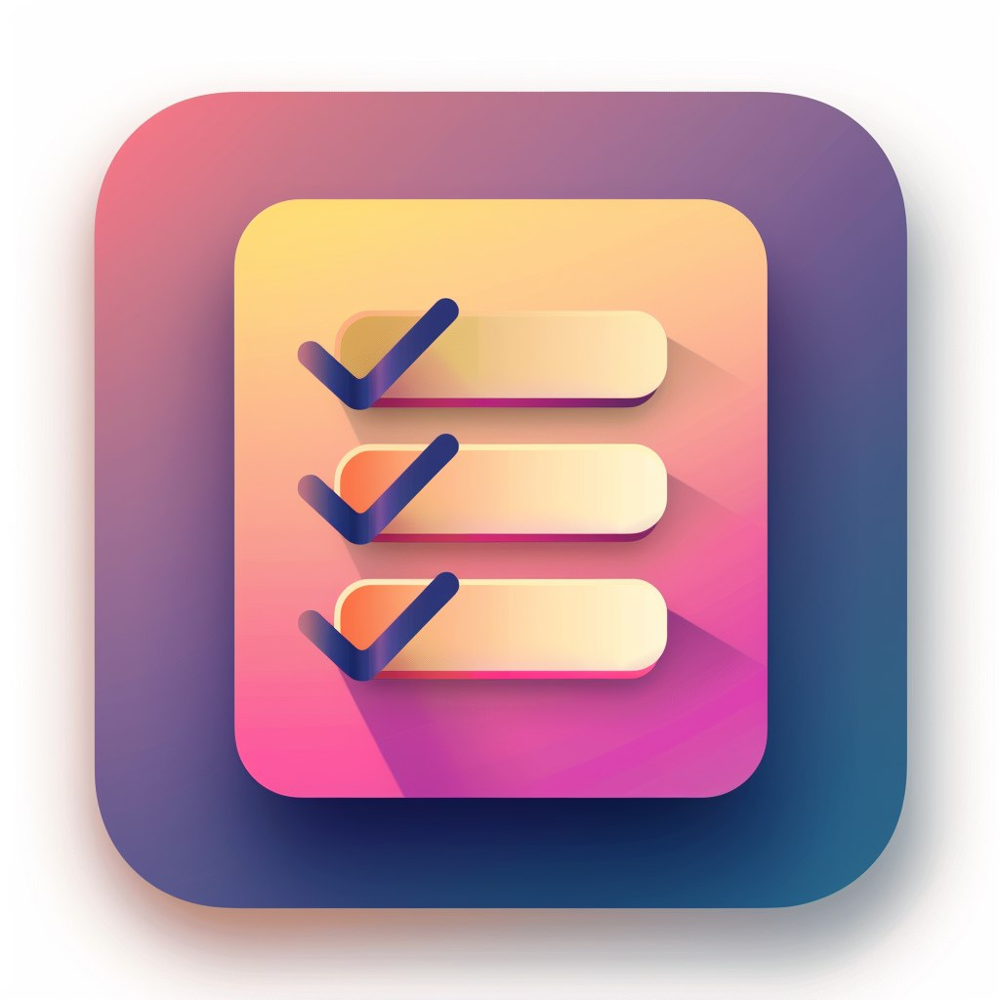
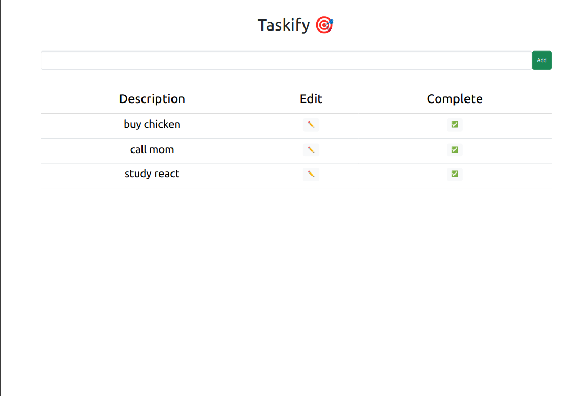
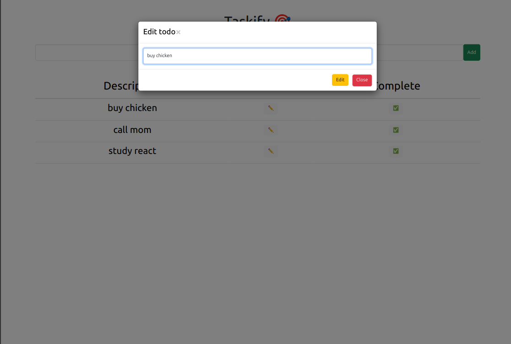

<h1 align="center">
  <br>
 </img>

  <br>
  Taskify 🎯
  <br>
</h1>

<h4 align="center">A minimal TODO app using the famous PERN stak.</h4>

<p align="center">
  <a href="#key-features">Key Features</a> •
  <a href="#how-to-use">How To Use</a> •
  <a href="#download">Download</a> •
  <a href="#credits">Credits</a> •
  <a href="#related">Related</a> •
  <a href="#license">License</a>
</p>

<p align="center">


</p>

## Key Features

* **Keep track of your day's tasks:** Allows users to keep track of their daily tasks backed by a PostgreSQL database.

* **Edit tasks:** Made a mistake? Easily edit your taks with the press of a button.

* **Delete functionality:** Didn't manage to get something done, or changed your mind? Delete a task altogether.

## How To Use
To clone and run this application, you'll need [Git](https://git-scm.com) and [Node.js](https://nodejs.org/en/download/) (which comes with [npm](http://npmjs.com)) installed on your computer.

For the frontend:

```bash
cd client/client

npm install

npm start
```

For the backend:

```bash
cd server

npm install

node server.js
```

For the server, you need to add your postgres connection string in the `.env` file:

```env
DATABASE_URL="DATABASE_URL=postgres://<db-user>:<password>@<url>:<db-port>/pernt
"
```

## Credits

This software uses the following open source packages:

- [React.js](https://react.dev/) for the client-side app
- [Node.js](https://nodejs.org/) for the backend
- [Express.js](https://expressjs.com/) API framework
- [Bootstrap](https://getbootstrap.com/) for styling
- [pg](https://node-postgres.com/) as PostgreSQL NodeJS client

## License

MIT
